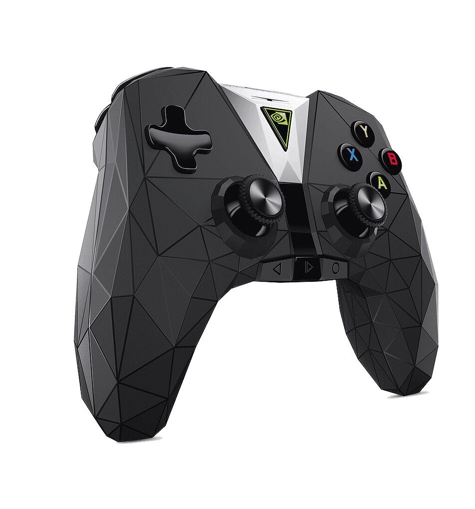

# AIREADME — AI 技术参考

> 本文档供 AI 助手阅读，包含项目的技术实现细节、协议逆向分析、架构决策。
> 用户文档见 `README.md`。

## 项目概述

NVIDIA SHIELD TV 2017（中国版）配套的 **Thunderstrike** 蓝牙手柄固件管理工具。
Go 语言编写，仅支持 Windows，通过蓝牙连接手柄。

核心能力：设备信息读取（HID）、固件刷写/降级/升级/平刷（SPP）、刷写后自动重启（HID CMD_RESET）。

## 通信架构

手柄通过蓝牙注册**两个独立接口**，各自使用不同协议：

| 接口 | UUID | Windows 路径 | 协议格式 | 用途 |
|------|------|-------------|----------|------|
| SPP | `{00001101-0000-1000-8000-00805f9b34fb}` | COM 口 (BTHENUM) | `[cmd][2B LE len][data]` | 固件刷写 |
| HID | `{00001124-0000-1000-8000-00805f9b34fb}` | `\\?\hid#vid_0955&pid_7214#...` | `[0x04][cmd][txn][data pad 33B]` | 设备信息查询 + 重启 |

> **关键发现**：SPP 串口上只支持刷写协议，不支持 HID 报告格式。
> 设备信息查询必须通过 Windows HID API（`SetupDiGetClassDevsW` + `CreateFileW` + `WriteFile`/`ReadFile`）。

### HID 报告格式

```
请求: [0x04] [cmd_ordinal] [transaction_id] [data...] [zero-padded to 33 bytes]
响应: [0x03] [cmd_ordinal] [transaction_id] [response_data...]
```

- ReportLen = 33（30 字节数据区 + 3 字节头部，来自 `Bt_Ops.smali`: `mReportLen = getHidrawReportLength() + 3`）
- MaxResponseSize = 65（来自 `DevHidraw.MAX_RESPONSE_SIZE`）
- 设备返回 `cmd=0xFF` 表示命令不支持（`ErrCmdError`）

### SPP 刷写协议

**命令格式**（PC → 手柄）：`[1B CommandCode] [2B LE length] [N bytes data]`

**响应格式**（手柄 → PC）：`[1B CommandCode] [1B StatusCode] [1B payload_len] [N bytes payload]`

#### SPP 命令码

| 命令 | Code | 超时 | 说明 |
|------|------|------|------|
| NOP | 0x00 | 5s | 握手（发送两次：先 WriteCommand 唤醒，再 ExecuteCommand 确认） |
| ERASE_SQIF | 0x01 | 20s | 擦除 SQIF 闪存，参数 `[0x00]` |
| WRITE_SQIF | 0x02 | 2s/块 | 分块写入，1024 字节/块，每块等 ACK |
| VALIDATE_SQIF | 0x03 | 20s | 验证写入数据 |
| APPLY_OTA | 0x05 | — | 应用固件，参数 `[0x00]`，发送后设备自动重启 |

#### SPP 状态码

| 状态 | Code | 说明 |
|------|------|------|
| COMPLETED_OK | 0x00 | 成功 |
| IN_PROGRESS | 0x01 | 执行中（ReadResponse 自动跳过重试） |
| FAILED | 0x02 | 失败 |
| TIMEOUT | 0x03 | 超时 |
| FAILED_LOW_BATTERY | 0x06 | 电量不足 |
| FAILED_SIGNATURE | 0x07 | 签名验证失败 |
| FAILED_FLASH_ERROR | 0x08 | 闪存错误 |

> `ReadResponse` 只跳过 `IN_PROGRESS`，不跳过 `DIAG_IN_PROGRESS`（与 smali 一致）。

### HID 命令码（设备信息查询 + 重启）

完整 159 个命令枚举见 `hid/commands.go`。实际使用的：

| 命令 | Code | 说明 |
|------|------|------|
| VERSION | 0x01 | 返回 `[fw_minor][fw_major][csr_minor][csr_major][hw_minor][hw_major]` |
| MAC_ADDRESS | 0x0B | 返回 6 字节 MAC |
| BOARD_INFO | 0x10 | 返回 `[board_type][board_rev][serial_ascii...]` |
| RESET | 0x36 | 重启设备，参数 `[0x01]`（对应 `Bt_Ops.requestReboot()`） |

## 设备发现（WMI）

通过 PowerShell 调 `Get-WmiObject Win32_SerialPort` 获取蓝牙 SPP COM 口：

1. `PNPDeviceID` 格式：`BTHENUM\{SPP_UUID}_VID&XXXX_PID&YYYY\7&...&MAC_C00000000`（outgoing）或 `BTHENUM\{SPP_UUID}_LOCALMFG&NNNN\...`（incoming）
2. 同一蓝牙设备分配两个 COM 口：outgoing（有 VID&/PID& 和真实 MAC）和 incoming（LOCALMFG& 和全零 MAC）
3. 只保留 outgoing 端口（含 `VID&`），过滤 incoming 和 MAC 全零端口
4. MAC 提取：从 PNPDeviceID 最后一个 `\` 分隔段提取 12 位 hex（跳过 GUID 段，避免误提 SPP UUID 中的 `00805F9B34FB`）
5. 设备识别：`VID&00020955` + `PID&7214` = NVIDIA Thunderstrike 手柄

## 刷写流程

### 完整序列

```
NOP(握手) → ERASE_SQIF(擦除) → WRITE_SQIF(循环写入.ota, 1024B/块) → VALIDATE_SQIF(校验) → APPLY_OTA(应用) → HID CMD_RESET(确保重启)
```

### APPLY_OTA 后的处理

原版 APK（`BtUpdater.smali` `sendUpdateCore`）在 APPLY_OTA 后：
1. `WriteCommand(APPLY_OTA)` → `sleep(1s)` → `close()`
2. `waitForDisconnect(40s)` — 等待设备断开
3. `waitForConnect(120s)` — 等待重连
4. `waitForDeviceReady(30s)` — 等待就绪

PC 端无法自动重连蓝牙，本工具的策略：
1. `applyOta()` 发送 APPLY_OTA + `sleep(1s)` + 关闭 SPP 串口
2. 刷写完成后通过 HID 接口发送 `CMD_RESET(0x36)` 确保重启
3. 等待 5 秒后检测 HID 设备是否重新连接

### HID CMD_RESET 重启

原版 APK `Bt_Ops.requestReboot()` 调用 `requestData(CMD_RESET, 1)`。
实测确认：发送后设备断开约 1 秒，然后自动重连。

实现见 `cmd/interactive_flash.go` 的 `sendHidReset()`：
- 打开 HID 设备 → `SendCommand(CmdReset, [0x01])`
- 设备收到后立即断开，`ReadFile` 超时属正常，只要 `WriteFile` 成功即可

## 固件降级原理

1. Android `BtUpdater` 在升级前检查 `manifest.xml` 版本号，新版本 <= 当前则拒绝
2. 但 SPP 协议的 `ERASE_SQIF` / `WRITE_SQIF` / `APPLY_OTA` **不检查版本号**
3. 只要 `VALIDATE_SQIF` 阶段签名验证通过，即可刷写成功
4. 本工具直接通过 SPP 刷写旧固件，绕过 Android 端降级限制

### 为什么不能通过 USB 刷固件

从 smali 反编译确认：
1. `ThunderstrikeController.getUpdateState()` 检查 USB 连接，USB 连接存在则返回 `DEVICE_UNSUPPORTED`
2. `ThunderstrikeController.getUpdater()` 始终返回 `BtUpdater`（蓝牙 SPP），无 USB 路径
3. HID 报告数据区仅 30 字节，固件几百 KB，SPP 支持 1024 字节/块大传输

## 固件包格式（.blkz）

`.blkz` 是 ZIP 归档（无压缩），包含：

| 文件 | 说明 |
|------|------|
| `manifest.xml` | 固件清单（版本号、配件类型、指纹） |
| `manifest.xml.sig` | 清单的 RSA 签名 |
| `thunderstrike.ota` | 固件二进制数据 |
| `thunderstrike.ota.sig` | 固件的 RSA 签名 |

### blkz 目录规范

1. `blkz/` 目录始终和程序放在一起
2. 文件名规范：`设备代号_版本号.blkz`，如 `Thunderstrike_0x010E.blkz`
3. 多语言固件：`设备代号_locale_版本号.blkz`
4. 刷机时先将 `.blkz` 解压到同名子目录
5. 版本号从 `manifest.xml` 读取，不依赖文件名

### 固件校验

- `.sig` 签名文件不发送给手柄（原版用 RSA 验签，本工具用 MD5 校验）
- 内置已知固件 MD5，防止刷错固件导致变砖

## 升级时间参数

来自 `ThunderstrikeController.smali` 的 `getUpgradeTimings()`：

| 参数 | 值 | 说明 |
|------|------|------|
| EraseMs | 0x960 = 2400ms | SQIF 擦除时间 |
| BytesPerSec | 0x6784 = 26484 | 估计写入速度 |
| ApplyDelayMs | 0x157C = 5500ms | Apply OTA 延迟 |
| ReadyTimeMs | 0x251C = 9500ms | 设备就绪等待 |
| ReconnectMs | 0 | 重连延迟（非 locale 版本为 0） |

## 固件版本

| 版本 | 代号 | 说明 |
|------|------|------|
| v1.14 | 0x010E | 不能XY |
| v1.18 | 0x0112 | 推荐版本 |
| v1.33 | 0x0121 | 不能A+B |
| v1.36 | 0x0124 | 不能A+B |

### 固件提取位置

手柄固件 `.blkz` 包位于 SHIELD TV 恢复镜像的 ext4 分区中：

```
nv-recovery-image-shield-2017-atv-9.2.1\vendor.ext4\oem\firmware\
```

解压恢复镜像后，在 `vendor.ext4` 分区的 `oem/firmware/` 目录下找到固件包。

实测：V1.33 → V1.18 降级成功，CSR 芯片版本同步降级（v0.18 → v0.17），热词引擎同步降级（v1.05 → v1.04）。

## 项目结构

```
ThunderstrikeControllerTool/
├── main.go                         # 程序入口，注册 cobra 命令
├── cmd/                            # CLI 命令
│   ├── root.go                     # 根命令
│   ├── scan.go                     # scan — 扫描蓝牙 SPP 串口
│   ├── bt_discovery_windows.go     # WMI 查询蓝牙 SPP COM 口
│   ├── bt_info.go                  # 设备信息读取（Windows HID API）
│   ├── interactive.go              # 交互模式入口
│   ├── interactive_flash.go        # 交互模式刷写流程 + sendHidReset
│   ├── flash.go                    # flash — 命令行刷写
│   ├── flash_core.go               # 刷写核心逻辑（共用）
│   └── blkz_list.go                # 固件列表显示
├── hid/                            # HID 协议
│   ├── commands.go                 # 159 个命令枚举 + 协议常量
│   └── windows_client.go           # Windows HID API 客户端
├── spp/                            # 蓝牙 SPP 协议栈
│   ├── protocol.go                 # 命令码、状态码、超时、UpgradeTimings
│   ├── client.go                   # SPP 客户端（WriteCommand/ReadResponse/Connect）
│   ├── flasher.go                  # 刷写流程（NOP→ERASE→WRITE→VALIDATE→APPLY）
│   └── hidraw_client.go            # [遗留] HID-over-SPP 客户端（已被 HID API 替代）
├── firmware/                       # 固件解析
│   ├── blkz.go                     # .blkz 包解析+解压
│   ├── manifest.go                 # manifest.xml 解析
│   └── checksum.go                 # MD5 校验
├── logger/                         # 刷写日志记录
│   └── logger.go                   # 时间戳日志文件
├── term/                           # 终端控制
│   └── term.go                     # ANSI 转义码（清屏、光标等）
├── Release/                        # 编译打包目录
│   ├── Release.zip                 # 包含了手柄固件+刷写工具
```

## 逆向分析来源

逆向分析所用 APK 来自 SHIELD TV 2017 恢复镜像：

```
nv-recovery-image-shield-2017-atv-9.2.1\vendor.ext4\app\NvAccessories\NvAccessories.apk
```

| smali 文件 | 提取的信息 |
|-----------|-----------|
| `Bt_Ops.smali` | HID 命令格式、`requestData()` 方法、`requestReboot()` |
| `Bt_Ops$BtHidrawCommand.smali` | 159 个 HID 命令枚举及 ordinal（0x00–0x9E） |
| `ThunderstrikeController.smali` | Report 长度（30B）、升级时间参数 |
| `BtUpdater.smali` | SPP 命令/状态枚举、刷写流程（`sendUpdateCore`） |
| `BtUpdater$Command.smali` | SPP 命令包格式：`[cmd][2B LE len][data]` |
| `BtUpdater$Response.smali` | SPP 响应包格式：`[cmd][status][len][payload]` |
| `FirmwareFile.smali` | `.blkz` 格式、`manifest.xml` 结构 |

### 内核源码交叉验证

SHIELD TV 2017 内核源码关键发现：
- `TS_HOSTCMD_REPORT_SIZE = 33` — 确认 HID 报告总长度
- `USB_DEVICE_ID_NVIDIA_THUNDERSTRIKE = 0x7214` — 确认 PID
- ICM-20628 6 轴 IMU（加速度计+陀螺仪）
- 音频支持 ADPCM（Report ID=30）和 mSBC（Report ID=0xF7/0xFA/0xFB）
