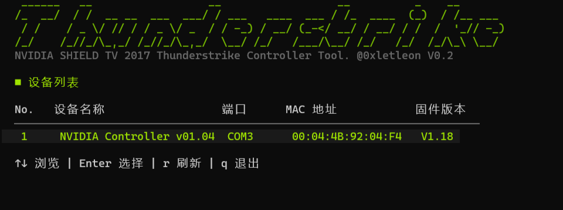
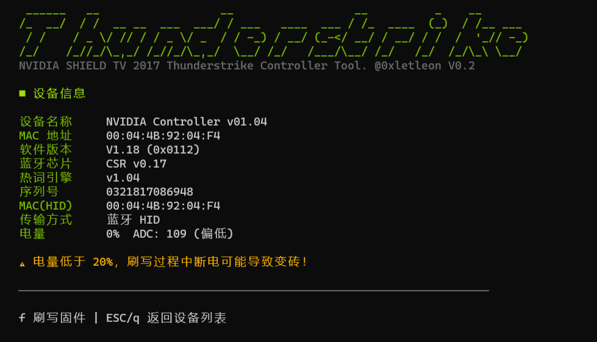
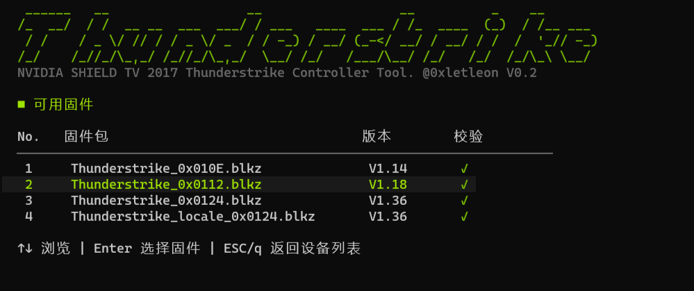
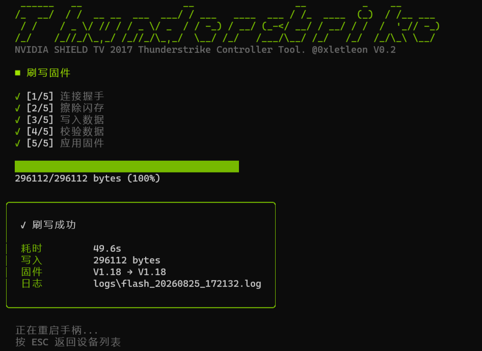

# Thunderstrike Controller Tool v0.3

    NVIDIA SHIELD TV 2017 Thunderstrike Controller Flash Tool - 手柄固件工具
    支持固件 降级 / 升级 / 平刷 · 设备信息读取
    仅支持 Windows · 仅通过蓝牙连接






## 🛑警告！！！

    没有大量真实用户实测！
    仅我自己降级升级平刷测试成功！
    使用本软件刷写固件时请自行承担风险。


## 这是什么？

如果你有一台 NVIDIA SHIELD TV 2017（中国版）和配套的 Thunderstrike 蓝牙手柄，
这个工具可以帮你：

- 📋 **查看手柄信息** — 固件版本、硬件版本、序列号、MAC 地址、电量
- 🔄 **刷写固件** — 升级、降级、平刷都可以
- 🌐 **多语言固件** — 支持多语言版本的固件包
- ✅ **安全校验** — 刷写前自动 MD5 校验，防止刷错固件
- 📝 **完整日志** — 刷写过程自动记录设备信息、电量、进度、结果


## 快速开始

### 1. 下载

下载最新版本的 `Release\` 目录下的 `Release.zip` ，解压。

### 2. 准备固件

把 `.blkz` 固件包放到 `tsct.exe` 同目录的 `blkz/` 文件夹中。
程序自带了一些固件包，你也可以自己添加。

### 3. 连接手柄

1. 打开电脑蓝牙
2. 将手柄与电脑配对（在 Windows 蓝牙设置中添加设备）
3. 配对成功后 Windows 会自动分配一个 COM 端口

### 4. 运行

双击 `tsct.exe` 或在命令行中运行：

```
tsct
```

程序启动后会显示 TUI 界面，自动发现手柄并显示设备列表。
使用方向键浏览、Enter 选择，即可查看设备信息和刷写固件。

### TUI 操作指南

| 按键 | 功能 |
|------|------|
| `↑` / `↓` 或 `k` / `j` | 浏览列表 |
| `Enter` | 确认选择 |
| `r` | 刷新设备列表 |
| `f` | 进入刷写流程 |
| `ESC` / `q` | 返回上一级 |
| `Ctrl+C` | 退出程序 |


## 固件版本

| 版本 | 说明 |
|------|------|
| V1.14 | 不能XY |
| V1.18 | 推荐版本 |
| V1.33 | 不能A+B |
| V1.36 | 不能A+B |

> 本工具不检查版本号，可以自由升降级，只要固件签名匹配即可刷写。
> 已实测验证：V1.33 → V1.18 降级成功。

## 固件包目录

固件包放在 `blkz/` 文件夹中，文件名格式：

```
blkz/
├── Thunderstrike_0x010E.blkz        # V1.14
├── Thunderstrike_0x0112.blkz        # V1.18
├── Thunderstrike_0x0124.blkz        # V1.36
└── Thunderstrike_locale_0x0124.blkz  # V1.36 多语言
```

## 从源码编译

需要 Go 1.24+：

```powershell
go mod tidy
go build -o tsct.exe .
```

## 技术栈

### TUI 框架

本项目使用 [Charm](https://github.com/charmbracelet) 全家桶构建终端用户界面：

| 库 | 说明 |
|---|---|
| [Bubble Tea](https://github.com/charmbracelet/bubbletea) | Elm 架构的 TUI 框架，管理状态机和事件循环 |
| [Bubbles](https://github.com/charmbracelet/bubbles) | TUI 组件库（进度条、列表等） |
| [Lipgloss](https://github.com/charmbracelet/lipgloss) | 终端样式库（颜色、边框、对齐） |
| [go-figure](https://github.com/common-nighthawk/go-figure) | ASCII Art 标题渲染 |

### 核心依赖

| 库 | 说明 |
|---|---|
| [go.bug.st/serial](https://github.com/bugst/go-serial) | 串口通信（SPP 蓝牙串口） |
| [golang.org/x/sys](https://pkg.go.dev/golang.org/x/sys) | Windows 系统 API（HID、WMI） |

### 项目结构

```
ThunderstrikeControllerTool/
├── main.go              # 程序入口
├── tui/                 # TUI 层（Bubble Tea）
│   ├── model.go         # 主状态机（页面切换）
│   ├── device_list.go   # 设备列表视图
│   ├── device_info_view.go # 设备信息视图
│   ├── firmware_list.go # 固件列表视图
│   ├── flash_progress.go # 刷写进度视图
│   ├── styles.go        # NVIDIA 品牌色样式
│   ├── ascii_title.go   # ASCII Art 标题
│   ├── text_align.go    # 中英文对齐工具
│   ├── types.go         # 数据传递类型
│   └── run.go           # TUI 启动入口
├── cmd/                 # 业务逻辑层
│   ├── tui_adapter.go   # TUI 接口适配器
│   ├── helpers.go       # 辅助函数
│   ├── flash_core.go    # 刷写核心逻辑
│   └── bt_discovery_windows.go # 蓝牙设备扫描
├── hid/                 # HID 通信
├── spp/                 # SPP 串口协议
├── firmware/            # 固件包解析
└── logger/              # 刷写日志记录
```

## 注意事项

⚠️ **刷写有风险，请注意：**
- 电池电量要充足（> 20%）
- 刷写过程中不要断开蓝牙
- 手柄休眠后会断开连接，刷写前请操作手柄保持唤醒
- 保留一份已知良好的固件包以备恢复

⚠️ **蓝牙连接说明：**
- 手柄需要先与电脑蓝牙配对
- 如果设备列表中没有手柄，请检查蓝牙配对状态
- 手柄休眠后可能需要按键唤醒才能重新发现


## 技术文档

技术实现细节和协议逆向分析见 [AIREADME.md](AIREADME.md)。

## 许可证

本项目仅供学习和研究使用。
NVIDIA、SHIELD、Thunderstrike 是 NVIDIA Corporation 的商标。
