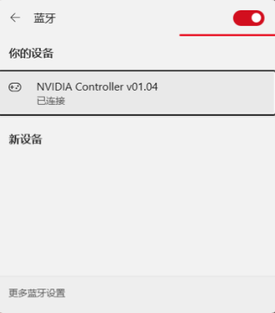
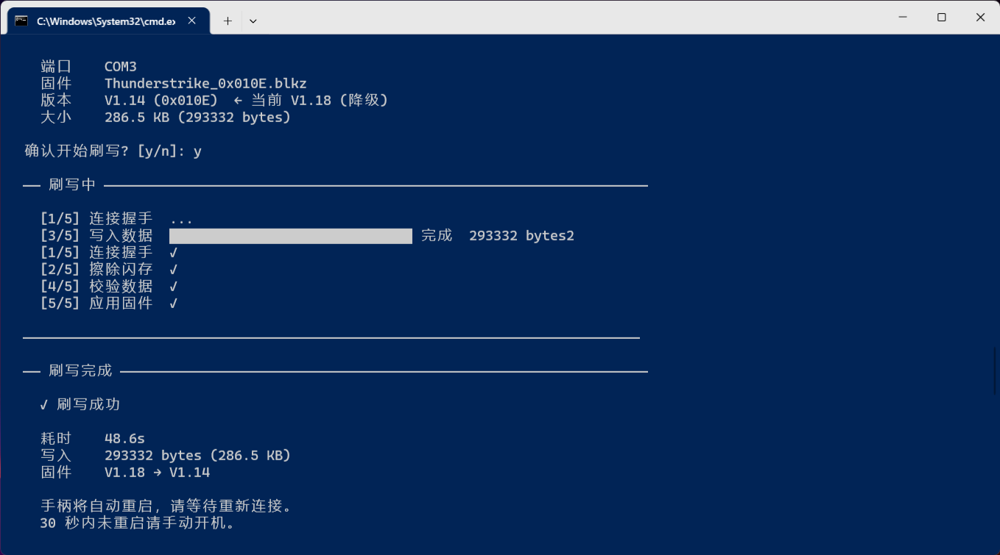
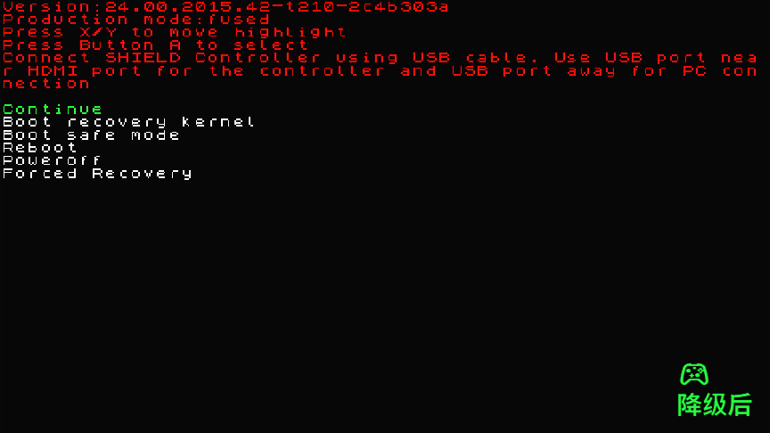

# Thunderstrike Controller Tool

    NVIDIA SHIELD TV 2017 Controller Thunderstrike 蓝牙手柄固件管理工具
    支持固件刷写 / 降级 / 升级 / 平刷 · 设备信息读取
    仅支持 Windows · 仅通过蓝牙连接

## 🛑警告！！！

    没有大量真实用户实测！
    仅我自己降级升级平刷测试成功！
    使用本软件刷写固件时请自行承担风险。


## 这是什么？

如果你有一台 NVIDIA SHIELD TV 2017（中国版）和配套的 Thunderstrike 蓝牙手柄，
这个工具可以帮你：

- 📋 **查看手柄信息** — 固件版本、硬件版本、序列号、MAC 地址
- 🔄 **刷写固件** — 升级、降级、平刷都可以
- 🌐 **多语言固件** — 支持多语言版本的固件包
- ✅ **安全校验** — 刷写前自动 MD5 校验，防止刷错固件

## 快速开始

### 1. 下载

下载最新版本的 `Release\` 目录下的 `Release.zip` ，解压。

### 2. 准备固件

把 `.blkz` 固件包放到 `tsct.exe` 同目录的 `blkz/` 文件夹中。
程序自带了一些固件包，你也可以自己添加。

### 3. 连接手柄

1. 打开电脑蓝牙
2. 将手柄与电脑配对（在 Windows 蓝牙设置中添加设备）
3. 配对成功后 Windows 会自动分配一个 COM 端口

### 4. 运行

双击 `tsct.exe` 或在命令行中运行：

```
tsct
```

程序会自动发现手柄，显示设备列表。选择设备编号后即可查看信息和刷写固件。


## 固件版本

| 版本 | 说明 |
|------|------|
| V1.14 | 旧版固件 |
| V1.18 | 推荐版本 |
| V1.33 | 出厂安装版本 |
| V1.36 | 多语言版本 |

> 本工具不检查版本号，可以自由升降级，只要固件签名匹配即可刷写。
> 已实测验证：V1.33 → V1.18 降级成功。

## 固件包目录

固件包放在 `blkz/` 文件夹中，文件名格式：

```
blkz/
├── Thunderstrike_0x010E.blkz        # V1.14
├── Thunderstrike_0x0112.blkz        # V1.18
├── Thunderstrike_0x0124.blkz        # V1.36
└── Thunderstrike_locale_0x0124.blkz  # V1.36 多语言
```

## 从源码编译

需要 Go 1.21+：

```powershell
go mod tidy
go build -o tsct.exe .
```

## 刷固件过程

    我的情况是 卡 Google Logo


    手柄链接电脑蓝牙



    开始刷固件


    $>tsct.exe
    Thunderstrike Controller Tool
    NVIDIA SHIELD TV 2017 手柄管理工具
    设备信息读取 · 固件刷写/降级/升级/平刷
    ──────────────────────────────────────────────────────────────────────────

    找到 1 个设备

        No.  设备名称             端口    MAC 地址
        ─────────────────────────────────────────────
        1    NVIDIA Controller  COM3     00:04:4B:92:04:F4

    选择设备 [1] | 刷新 [Enter] | 退出 [q]: 1
    Thunderstrike Controller Tool
    NVIDIA SHIELD TV 2017 手柄管理工具
    设备信息读取 · 固件刷写/降级/升级/平刷
    ──────────────────────────────────────────────────────────────────────────

    ── 设备信息 ─────────────────────────────────────────────────────────────────

        设备名称 NVIDIA Controller
        MAC 地址 00:04:4B:92:04:F4
        软件版本 V1.14 (0x010E)
        蓝牙芯片 CSR v0.17
        热词引擎 v1.04
        硬件版本 Board 0 Rev 2
        序列号  0321817086948
        MAC(HID) 00:04:4B:92:04:F4
        传输方式 蓝牙 HID

    ────────────────────────────────────────────────────────────────────────────

    刷写固件? [y/n]: y

    ── 可用固件 ─────────────────────────────────────────────────────────────────

        No.  固件包                              版本     校验
        ─────────────────────────────────────────────────────
        1   Thunderstrike_0x010E.blkz             V1.14    ✓
        2   Thunderstrike_0x0112.blkz             V1.18    ✓
        3   Thunderstrike_0x0124.blkz             V1.36    ✓
        4   Thunderstrike_locale_0x0124.blkz      V1.36    ✓

    选择固件 [1-4] | 返回 [Enter]: 2

    ── 刷写确认 ─────────────────────────────────────────────────────────────────

        端口    COM3
        固件    Thunderstrike_0x0112.blkz
        版本    V1.18 (0x0112)  ← 当前 V1.14 (升级)
        大小    289.2 KB (296112 bytes)

    确认开始刷写? [y/n]: y

    ── 刷写中 ───────────────────────────────────────────────────────────────────

        [1/5] 连接握手  ...
        [3/5] 写入数据  ██████████████████████████████ 完成  296112 bytes2
        [1/5] 连接握手  ✓
        [2/5] 擦除闪存  ✓
        [4/5] 校验数据  ✓
        [5/5] 应用固件  ✓

    ────────────────────────────────────────────────────────────────────────────

    ── 刷写完成 ─────────────────────────────────────────────────────────────────

        ✓ 刷写成功

        耗时    46.5s
        写入    296112 bytes (289.2 KB)
        固件    V1.14 → V1.18

        手柄将自动重启，请等待重新连接。
        30 秒内未重启请手动开机。

        日志已保存: \logs\flash_20260824_221142.log

    ────────────────────────────────────────────────────────────────────────────

    按 Enter 刷新，输入 q 退出:
    Thunderstrike Controller Tool
    NVIDIA SHIELD TV 2017 手柄管理工具
    设备信息读取 · 固件刷写/降级/升级/平刷
    ──────────────────────────────────────────────────────────────────────────

    找到 1 个设备

        No.  设备名称             端口    MAC 地址
        ─────────────────────────────────────────────
        1    NVIDIA Controller  COM3     00:04:4B:92:04:F4

    选择设备 [1] | 刷新 [Enter] | 退出 [q]: 1
    Thunderstrike Controller Tool
    NVIDIA SHIELD TV 2017 手柄管理工具
    设备信息读取 · 固件刷写/降级/升级/平刷
    ──────────────────────────────────────────────────────────────────────────

    ── 设备信息 ─────────────────────────────────────────────────────────────────

        设备名称 NVIDIA Controller
        MAC 地址 00:04:4B:92:04:F4
        软件版本 V1.18 (0x0112)
        蓝牙芯片 CSR v0.17
        热词引擎 v1.04
        硬件版本 Board 0 Rev 2
        序列号  0321817086948
        MAC(HID) 00:04:4B:92:04:F4
        传输方式 蓝牙 HID

    ────────────────────────────────────────────────────────────────────────────

    刷写固件? [y/n]: n

    按 Enter 刷新，输入 q 退出: q




    可以按A+B进入 这个模式,刷机成功！
    (啥模式我都忘了，哈哈哈~)
    我忘了,原来的版本好像是 v1.33 !

## 注意事项

⚠️ **刷写有风险，请注意：**
- 电池电量要充足（> 20%）
- 刷写过程中不要断开蓝牙
- 手柄休眠后会断开连接，刷写前请操作手柄保持唤醒
- 保留一份已知良好的固件包以备恢复

⚠️ **蓝牙连接说明：**
- 手柄需要先与电脑蓝牙配对
- 如果设备列表中没有手柄，请检查蓝牙配对状态
- 手柄休眠后可能需要按键唤醒才能重新发现

## 技术文档

技术实现细节和协议逆向分析见 [AIREADME.md](AIREADME.md)。

## 许可证

本项目仅供学习和研究使用。
NVIDIA、SHIELD、Thunderstrike 是 NVIDIA Corporation 的商标。
